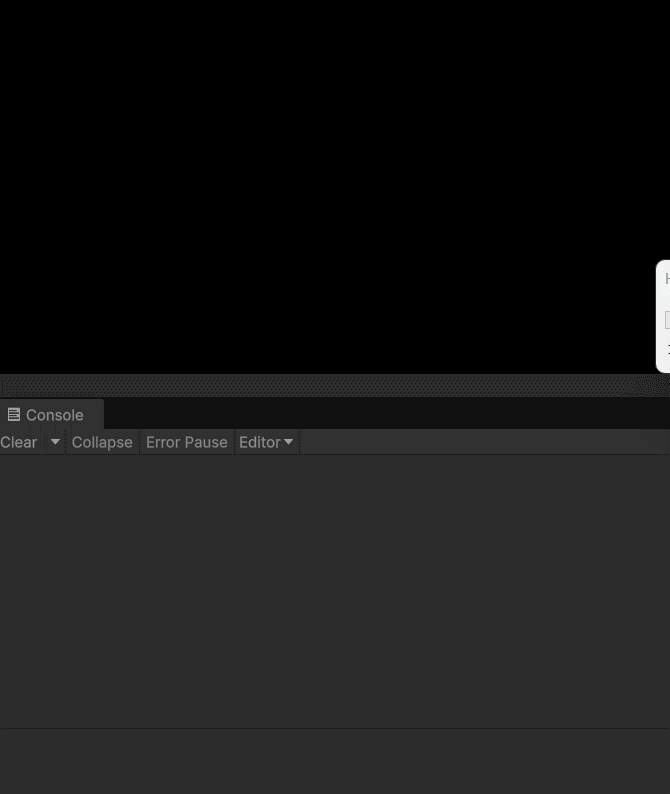

# Unity Paywall Onboarding Screen

Test task: Adaptive onboarding screen with ad preloading logic using only standard Unity UI components.



## Implementation
- **Bootstrapper.cs** - Entry point, initializes components on scene start
- **PaywallView.cs** - UI controller with fade-in animation (CanvasGroup alpha transition)
- **ButtonPulseAnimation.cs** - Continuous button pulse effect using `transform.localScale`
- **AdLoader.cs** - Simulates ad preloading (3-5 seconds random delay) with state tracking

## Features
- ✅ Responsive layout with UI anchors for mobile screens (iOS/Android)
- ✅ Custom fade-in animation on scene start
- ✅ Continuous button pulse animation
- ✅ Background ad preloading starts immediately on scene load
- ✅ Button click blocked until ad is cached (logs "Реклама еще загружается...")
- ✅ After cache completes, click shows ad (logs "Реклама успешно показана")

## Project Structure
```
Assets/Scripts/
├── Infrastructure/
│   ├── Bootstrapper.cs
│   └── AdLoader.cs
└── UI/
    ├── PaywallView.cs
    └── ButtonPulseAnimation.cs
```
